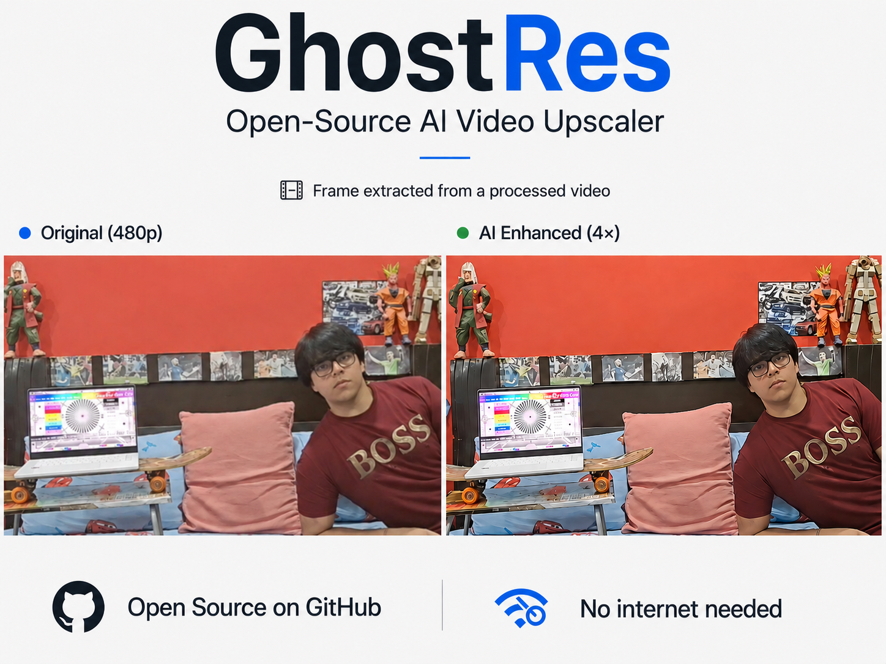

# GhostRes

> Local AI-powered video upscaling — no API, no internet, no subscription. Your footage never leaves your machine.

GhostRes takes a low-resolution video (480p / 720p) and enhances it to 2× or 4× resolution using the **Real-ESRGAN** neural network, running entirely on your local NVIDIA GPU.

---

## How It Works

Standard upscaling stretches pixels — edges blur, details vanish. GhostRes uses Real-ESRGAN, a neural network trained on thousands of images, to **predict** what the missing pixels should look like rather than interpolating them. It reconstructs edges, textures, and fine detail that weren't visible in the original footage.

Result: your 480p video doesn't just get bigger — it gets sharper.

---

## Requirements

**Hardware**
- NVIDIA GPU with CUDA support (CPU inference is not supported)

**Software**
- Python 3.10
- Anaconda
- NVIDIA CUDA drivers (CUDA 12.1 recommended)

---

## Setup

```bash
# 1. Clone this repo
git clone https://github.com/CoderCartikey/GhostRes.git
cd GhostRes

# 2. Create and activate conda environment
conda create -n ghostres python=3.10
conda activate ghostres

# 3. Install PyTorch with CUDA 12.1
pip install torch==2.2.0 torchvision==0.17.0 --index-url https://download.pytorch.org/whl/cu121

# 4. Install dependencies
pip install "numpy<2"
pip install basicsr facexlib gfpgan realesrgan

# 5. Clone Real-ESRGAN into your user directory
git clone https://github.com/xinntao/Real-ESRGAN.git C:\Users\YOUR_USERNAME\Real-ESRGAN

# 6. Download model weights
python download_model.py
```

> ⚠️ **numpy must be < 2.0** — if it gets auto-upgraded by another package, force reinstall it:
> ```bash
> pip install "numpy<2" --force-reinstall --no-deps
> ```

---

## Usage

1. Rename your input video to `input.mp4` and place it in the project root directory.
2. Run the enhancement script:

```bash
python video_enhance.py
```

3. The enhanced video will be saved as `output.mp4` in the same directory.

> ⚠️ **Render time warning:** GhostRes processes every frame individually through the full neural network. A 4-second video can take upwards of 2 hours on a mid-range GPU. This is expected behavior — not a crash or freeze. Always test with a short clip (3–5 seconds) first before running longer footage.

---

## Results



---

## Demo

> Video demo: `GhostResDEMO.mp4` (included in repo)

---

## Tech Stack

| Component | Details |
|---|---|
| Upscaling Model | Real-ESRGAN (x4plus) |
| Deep Learning Framework | PyTorch 2.2.0 |
| CUDA Version | 12.1 |
| Video Processing | OpenCV |
| Environment | Anaconda / Python 3.10 |

---

## Project Structure

```
GhostRes/
├── video_enhance.py      # Main enhancement script
├── download_model.py     # Model weight downloader
├── GhostRes1.png         # Sample results
├── GhostResDEMO.mp4      # Demo video
└── README.md
```

---

## Roadmap

- [ ] TensorRT optimization for faster inference
- [ ] Multi-scale output support (2×, 4×)
- [ ] Batch processing for multiple videos
- [ ] GUI / Desktop application

---

## Contributing

Contributions are welcome. If you find a bug, want to improve the pipeline, or add a feature — feel free to open an issue or submit a pull request.

If you're coming from the [TeamNeuron](https://teamneuron.blog) learning track, the codebase is structured to be readable and hackable. Start with `video_enhance.py` to understand the full pipeline.

---

## Built By

**Kartikey Bhardwaj** — B.Tech CSE, DIT University  
[GitHub](https://github.com/CoderCartikey) · [LinkedIn](https://www.linkedin.com/in/kartikey-bhardwaj-in)
